# Sprint Workflow

This diagram shows how a single story should move through a sprint when all roles participate.

```mermaid
flowchart LR
    PM["Product Manager<br/>Feature brief<br/>Acceptance criteria"]
    SM["Scrum Master<br/>Ready check<br/>Sprint coordination"]
    QR["Quant Researcher<br/>Research note<br/>Metrics and scenarios"]
    TL["Tech Lead<br/>Design note<br/>Task breakdown"]
    DEV["Developer<br/>Implementation<br/>Tests and docs"]
    QA["QA and Validation<br/>Acceptance check<br/>Regression check"]
    OPS["Release and Operations<br/>Config, rollout<br/>Monitoring"]
    REVIEW["Sprint review and retro<br/>Demo, learnings<br/>Backlog updates"]
    BACKLOG["Backlog refinement<br/>Reprioritize next work"]

    PM --> SM
    SM --> QR
    QR --> TL
    TL --> DEV
    DEV --> QA
    QA --> OPS
    OPS --> REVIEW
    REVIEW --> BACKLOG
    BACKLOG --> PM

    DEV -. design questions .-> TL
    QA -. defects or gaps .-> DEV
    OPS -. incidents and telemetry .-> BACKLOG
    SM -. blocker escalation .-> PM
```

## Reading the diagram

- Product Manager starts the story with a feature brief and acceptance criteria.
- Scrum Master checks that the story is small enough and ready for the sprint.
- Quant Researcher adds trading logic, assumptions, and validation metrics if the story affects strategy behavior.
- Tech Lead converts the brief into technical design and implementation tasks.
- Developer builds the change and updates tests and docs.
- QA validates both acceptance criteria and regressions.
- Release and Operations prepares rollout, config, and monitoring.
- Sprint review and retro feed learnings back into the backlog.

## Shortcut rule

Not every story needs heavy involvement from every role. If a story does not touch trading logic, the Quant Researcher step can be skipped, but the skip must be noted in the handoff record.

## Main feedback loops

- Developer to Tech Lead when design assumptions break during implementation
- QA to Developer when defects or edge-case failures appear
- Operations to Product Manager and Scrum Master when runtime behavior changes priority
